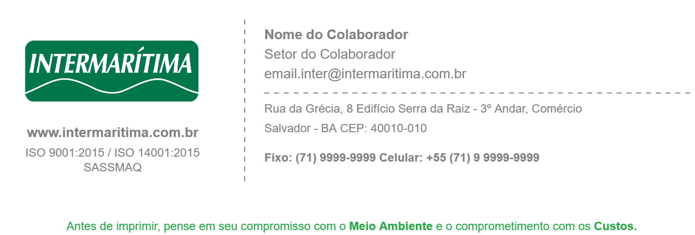
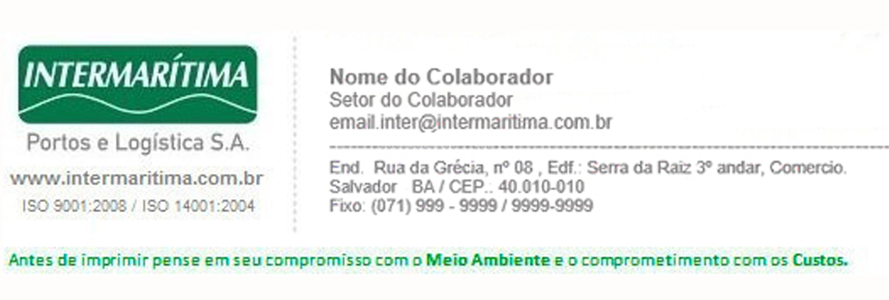

# ✉️ Portal de Atualização de Assinatura - Intermarítima

Bem-vindo ao sistema de solicitação de atualização de assinatura de e-mail institucional da Intermarítima!

  

Este portal foi desenvolvido para facilitar a padronização das assinaturas de colaboradores, conforme as diretrizes do setor de Marketing Estratégico e do Sistema de Gestão Integrado (SGI).

---

## 🚀 Funcionalidades

- ✅ Formulário com validação de CPF, e-mail corporativo, celular e fixo
- 📎 Upload ou colagem da assinatura antiga (imagem obrigatória)
- 🔍 Verificação automática se o colaborador já enviou uma solicitação
- 🖼 Pré-visualização da assinatura colada ou enviada
- 🧠 Sugestões inteligentes de domínio de e-mail
- 🔒 LGPD: CPF usado apenas para controle temporário
- 🌐 Interface responsiva e intuitiva
- 📦 Integração com Firebase (Firestore)

---

## 📸 Exemplos

Comparativo entre assinatura antiga e novo modelo:

| Novo Modelo | Antigo Modelo |
|-------------|---------------|
|  |  |

---

## 🧠 Como usar

1. Acesse o formulário
2. Preencha todos os campos obrigatórios
3. Anexe sua assinatura atual (imagem obrigatória)
4. Clique em **"Solicitar Assinatura Atualizada"**
5. Aguarde a nova assinatura no seu e-mail 📧

---

## ⚙️ Tecnologias utilizadas

- HTML5 + CSS3
- JavaScript
- Firebase Firestore
- SweetAlert2 (alertas)
- IMask (máscaras de input)
- FontAwesome
- Google Fonts (Roboto)

---

## 📁 Organização dos arquivos

